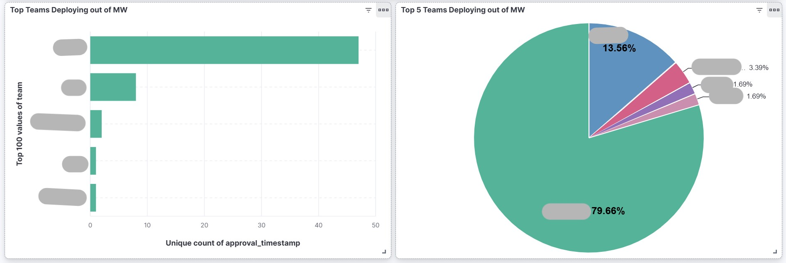
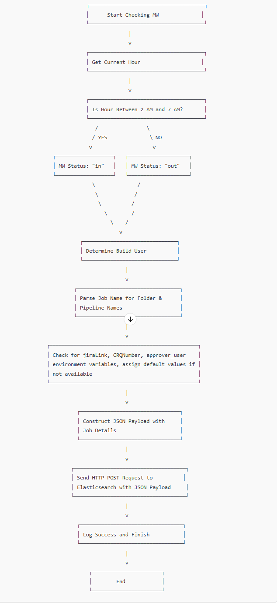
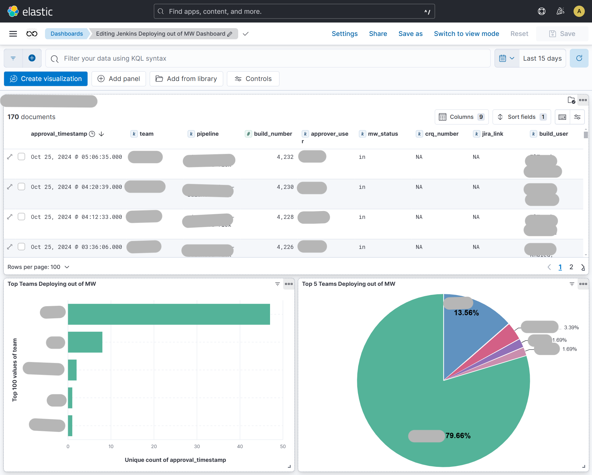
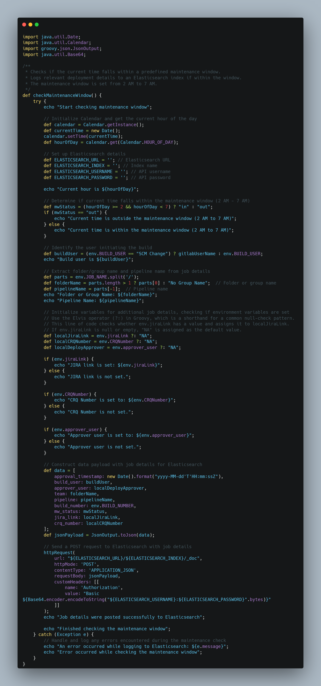

[![LinkedIn][linkedin-shield]][linkedin-url]

<!-- PROJECT LOGO -->
 

    
  <h3 align="center">Automated Production Deployment Monitor</h3>

<!-- TABLE OF CONTENTS -->

  
Table of Contents

  <ol>
    <li>
      <a href="#about-the-project">About The Project</a>
      <ul>
        <li><a href="#business-case">Business Case</a></li>
        <li><a href="#technical-solution">Technical Solution</a></li>
        <li><a href="#screenshots">Screenshots</a></li>
        <li><a href="#tech-stack">Tech Stack</a></li>
      </ul>
    </li>
    <li><a href="#contact">Contact</a></li>
  </ol>

<!-- ABOUT THE PROJECT -->
## About The Project

* **Project Name:** Automated Production Deployment Monitor  
* **Version:** v1.0.0  
* **Organization Department:** Technology

---

### Business Case

The **Automated Production Deployment Monitor** was developed to enhance security compliance and governance in deployment practices, specifically by monitoring deployment times and detecting production deployments occurring outside the designated maintenance window. This monitoring tool assists in supporting change management audits by ensuring compliance with pre-approved maintenance schedules and logging exceptions for audit purposes.

The solution primarily serves as an automated control measure to:
- Enforce compliance with deployment schedules.
- Log out-of-schedule production deployments in **Elasticsearch** for traceability and audit purposes.

(<a href="#readme-top">back to top</a>)

### Technical Solution

The pipeline automation performs the following steps:

1. **Branch Check**: Confirms that the deployment is occurring on the `main` branch.
2. **Time Check**: Validates the current deployment time against the maintenance window, which is designated from **2 AM to 7 AM**.
3. **Elasticsearch Logging**: Logs any deployments outside the maintenance window in Elasticsearch, creating a record for tracking and auditing purposes. Logged information includes:
    - Approval timestamp
    - Triggering user and approver
    - Team/folder name
    - Pipeline name and build number
    - Maintenance window compliance status
    - Relevant JIRA link or CRQ number if provided

---

**Benefits**:
   - Dashboard for monitoring deployments and changes, particularly those made outside the designated window.

(<a href="#readme-top">back to top</a>)

### Screenshots

#### System Flowchart

#### Dashboard View

#### Code Snapshot

(<a href="#readme-top">back to top</a>)

### Tech Stack

This project was developed using the following tech stack:

* **Groovy** (Jenkins Pipeline Scripting)
* **Elasticsearch** (for logging and tracking out-of-schedule deployments)
* **Jenkins Pipeline** (for CI/CD automation)

(<a href="#readme-top">back to top</a>)

<!-- CONTACT -->
## Contact

Mohamed AbdelGawad Ibrahim - [@m-abdelgawad](https://www.linkedin.com/in/m-abdelgawad/) - <a href="tel:+201069052620">+201069052620</a>

(<a href="#readme-top">back to top</a>)

<!-- MARKDOWN LINKS & IMAGES -->
[linkedin-shield]: https://img.shields.io/badge/-LinkedIn-black.svg?style=for-the-badge&logo=linkedin&colorB=555
[linkedin-url]: https://www.linkedin.com/in/m-abdelgawad/
